# Design Pattern Core Concepts

## Table of Contents
1. [SOLID Design Principles](#solid-design-principles-in-java)
2. [Username Lookup: Data Structure Comparison](#username-lookup-data-structure-comparison)
    > a. [How big tech combines data structures for efficient username lookup](#how-big-tech-combines-data-structures-for-efficient-username-lookup)
3. [OAuth 2.0 and OpenID Connect](#oauth-20-and-openid-connect)
## SOLID Design Principles

1. **S – Single Responsibility Principle (SRP)**

    **Definition:** A class should have only one reason to change, i.e., only one responsibility.
    ```java
    class InvoicePrinter {
        void print(Invoice invoice) { ... }
    }

    class InvoiceSaver {
        void saveToDatabase(Invoice invoice) { ... }
    }
    ```
    - Each class should do one thing and do it well.
2. **O – Open/Closed Principle (OCP)**

    **Definition:** Software entities (classes, modules, functions) should be open for extension but closed for modification.
    ```java
    interface Shape {
        double area();
    }

    class Circle implements Shape {
        double radius;
        public double area() { return Math.PI * radius * radius; }
    }

    class Rectangle implements Shape {
        double length, width;
        public double area() { return length * width; }
    }
    ```
    - We should be able to extend a class's behavior without modifying it.
    - A new shape can be added without changing the **existing classes**.

3. **L – Liskov Substitution Principle (LSP)**

    **Definition:** Subtypes must be substitutable for their base types without altering the correctness of the program. Subclass should extend the properties of parent class, not narrow it down.
    
    - Violation of LSP (Wrong Design)
        ```java
        class Bird {
            void fly() {
                System.out.println("Bird is flying");
            }
        }

        class Ostrich extends Bird {
            @Override
            void fly() {
                throw new UnsupportedOperationException("Ostrich can't fly"); ❌ Violation of LSP
            }
        }
        ```
        **Problem?**
        
        - If `Ostrich` is a `Bird`, we should be able to use it **anywhere** a `Bird` is expected. But calling `fly()` on an `Ostrich` throws an exception, breaking the behavior expected from the `Bird` class.
        
        - This violates LSP: **Subclasses should behave like their parent classes without breaking the program.**
    
    - **Corrected Version**
        ```java
        interface Bird {
            void makeSound();
        }

        interface FlyingBird extends Bird {
            void fly();
        }

        class Sparrow implements FlyingBird {
            public void makeSound() {
                System.out.println("Chirp chirp");
            }

            public void fly() {
                System.out.println("Sparrow is flying");
            }
        }

        class Ostrich implements Bird {
            public void makeSound() {
                System.out.println("Boom boom");
            }
        }
        ```
        - **Explanation:**

            - We split the `Bird` abstraction into two interfaces:

                - `Bird` → for general bird behavior
                - `FlyingBird` → for birds that can fly

            - Now `Ostrich` doesn't need to implement `fly()`, because it's not a `FlyingBird`.
            - This follows **LSP** — anywhere a `Bird` is expected, `Ostrich` can be used **without failure**

4. **I – Interface Segregation Principle (ISP)**

    **Definition:** No client should be forced to implement methods or depend on methods that it does not use.
    
    - Violation of ISP (Wrong Design)
        ```java
        interface Worker {
            void work();
            void eat();
        }

        class HumanWorker implements Worker {
            public void work() {
                System.out.println("Human working");
            }
            public void eat() {
                System.out.println("Human eating");
            }
        }

        class RobotWorker implements Worker {
            public void work() {
                System.out.println("Robot working");
            }
            public void eat() {
                // NOT APPLICABLE for Robot!
                throw new UnsupportedOperationException("Robot doesn't eat");
            }
        }
        ```
        **Problem:**
        - `RobotWorker` is **forced to implement** the `eat()` method even though it doesn't eat.
        - This breaks **ISP**, which says:
        `"Clients should not be forced to depend on methods they do not use."`
    
    - Correct Design (Follows ISP)
        ```java
        interface Workable {
            void work();
        }

        interface Eatable {
            void eat();
        }

        class HumanWorker implements Workable, Eatable {
            public void work() {
                System.out.println("Human working");
            }

            public void eat() {
                System.out.println("Human eating");
            }
        }

        class RobotWorker implements Workable {
            public void work() {
                System.out.println("Robot working");
            }
        }
        ```
        - `RobotWorker` **only implements what it needs:** `Workable`
        - `HumanWorker` can implement both.

5. **D – Dependency Inversion Principle (DIP)**

    **Definition:** High-level modules should not depend on low-level modules; both should depend on abstractions i.e. class should depend on interface rather than another class. 
    - Violation of DIP (Bad Design)
        ```java
        class LightBulb {
            public void turnOn() {
                System.out.println("LightBulb turned on");
            }

            public void turnOff() {
                System.out.println("LightBulb turned off");
            }
        }

        class Switch {
            private LightBulb bulb;

            public Switch(LightBulb bulb) {
                this.bulb = bulb;
            }

            public void operate(boolean on) {
                if (on) bulb.turnOn();
                else bulb.turnOff();
            }
        }
        ```
        - What’s wrong?
            - The `Switch` (high-level class) **directly depends** on the concrete `LightBulb` class (low-level class).
            - This tightly couples the `Switch` to the `LightBulb`. You cannot easily replace `LightBulb` with another implementation (e.g., `Fan`, `LED`, etc.).
    - Correct Design (Follows DIP)
        ```java
        // Abstraction
        interface Switchable {
            void turnOn();
            void turnOff();
        }

        // Low-level module
        class LightBulb implements Switchable {
            public void turnOn() {
                System.out.println("LightBulb turned on");
            }

            public void turnOff() {
                System.out.println("LightBulb turned off");
            }
        }

        // High-level module
        class Switch {
            private Switchable device;

            public Switch(Switchable device) {
                this.device = device;
            }

            public void operate(boolean on) {
                if (on) device.turnOn();
                else device.turnOff();
            }
        }
        ```
        - Why this is better?
            - Now `Switch` depends on the `Switchable` interface (abstraction), not a specific class.
            - This makes the system more **flexible** and **extensible**:
                - You can plug in any device that implements `Switchable` — `Fan`, `Heater`, `AC`, etc.

## Username Lookup: Data Structure Comparison

| Data Structure    | How It Works for Username Lookup   | Pros   | Cons   | Typical Use Case Fit     |
| ----------------- | ----------------------------- | -------------- | ----- | ---------------------- |
| **Redis HashMap** | Stores usernames as keys, with associated values (e.g., user ID, profile info). Lookup is **O(1)** average time complexity.                                                               | - Very fast for exact matches.<br>- Simple to implement.<br>- Built into Redis for in-memory speed.<br>- Can store metadata along with username.                 | - Requires full username for lookup (no prefix search).<br>- Memory usage proportional to number of entries.<br>- Slower if dataset exceeds RAM and swaps to disk. <br>- No prefix search, autocompletion, range queries. | Best for **exact username matches** when you have plenty of RAM and want fast retrieval. |
| **Trie**          | Each character is a node, and paths from root form usernames. Lookup complexity is **O(L)** where *L* = length of username.    | - Supports **prefix searches** (e.g., auto-complete, “users starting with A”).<br>- No hashing needed.<br>- Efficient when many usernames share common prefixes. | - Can be memory-heavy for sparse datasets(datasets with less share common prefixes) .<br>- Slower than hash for exact matches.<br>- Requires careful implementation to handle Unicode/variable length.      | Best when you need **autocomplete or prefix-based** username search.                     |
| **B+ Tree**       | Balanced tree structure with sorted keys (usernames). Lookup is **O(log N)**, supports range queries.                                                                                     | - Good for **range lookups** and ordered results.<br>- Disk-friendly (nodes align with block size).<br>- Used in databases and indexes.                          | - Slower than hash for exact matches.<br>- More complex to maintain than a HashMap.<br>- Needs rebalancing on inserts/deletes.                                     | Best when you want **sorted usernames** and efficient range queries.                     |
| **Bloom Filter**  | Probabilistic bit array with multiple hash functions. Can tell if username **possibly exists** or **definitely does not exist**. Lookup is **O(K)** where *K* = number of hash functions. | - Very memory-efficient.<br>- Extremely fast lookups.<br>- Good as a **pre-check** before expensive DB lookup.                                                   | - False positives possible (can say a username exists when it doesn’t).<br>- No storage of actual values.<br>- No removal unless using a counting bloom filter.    | Best as a **first filter** for existence checks to avoid hitting slower storage.         |

let’s make this username lookup comparison table more concrete with both time complexity and a space estimate for 1 million usernames, each 10 characters long.

| Data Structure  | Search Time Complexity | Space Usage for 1M usernames (10 chars) | Notes on Space Calculation   |
| ----------------- | ---------- | -------------------- | --------------------------------- |
| **Redis HashMap** | **O(1)** average, **O(N)** worst-case (hash collisions) | **\~30–40 MB**      | 10 MB for raw strings (10 chars × 1M) + \~20–30 MB for Redis object + hash overhead.      |
| **Trie**     | **O(L)** where L=10 (≈ O(10))     | **\~40–60 MB**                            | Each char is a node (\~16–24 bytes). Shared prefixes save memory, but sparse tries still have high overhead per pointer. |
| **B+ Tree**       | **O(log N)** ≈ O(log₂ 1M) = \~20 steps    | **\~35–45 MB**      | 10 MB for raw strings + \~25–35 MB for tree nodes, pointers, and balancing.      |
| **Bloom Filter**  | **O(K)** where K = # of hash functions (e.g., 4–8)      | **\~1.2 MB** (for 1% false positive rate) | Stores only a bit array, no actual usernames. Cannot retrieve usernames, only checks existence.  |

### How Big Tech Combines Data Structures for Efficient Username Lookup

Tech giants like Google, Meta, and Amazon must check billions of usernames within milliseconds every day. To accomplish this at scale, they don’t rely on a single data structure or system. Instead, they layer and combine multiple tools—each optimized for specific strengths—to achieve blazing speed, scalability, and reliability at a global level.

#### The Multi-Layered Approach

In this scenario, a new user attempts to create an account with a preferred username that must be unique. When the user enters the username, the system checks its availability—if it already exists, the user is prompted to try a different one; if it does not exist, the system confirms it can be used.

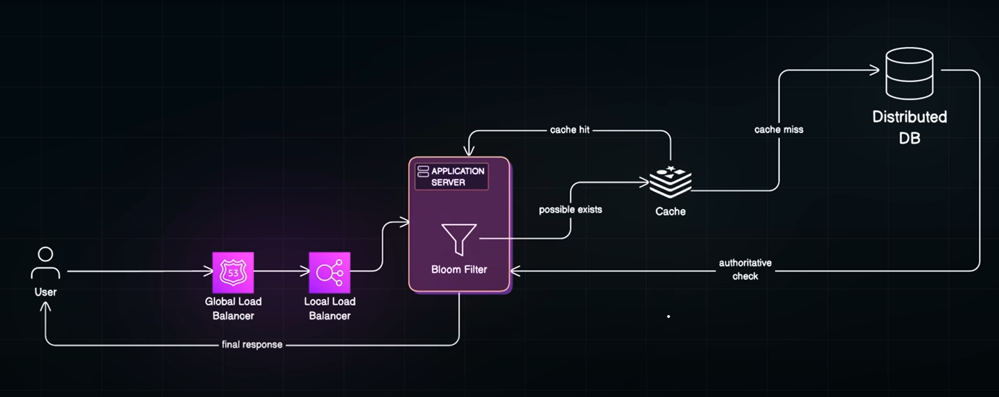

1. Load Balancing – Global & Local Routing

    - **Global Load Balancers** (like AWS Route 53) route user requests to the nearest data center using DNS or anycast techniques.

    - **Local Load Balancers** (like NGINX, AWS ELB) then distribute traffic among backend servers within each data center for high concurrency and efficient resource utilization

2. Bloom Filters: The First Line of Defense
    - Backend server keeps an in-memory Bloom filter—a very fast, tiny structure that tells if a username is definitely not taken, or maybe taken (with a small false positive rate).
    - If the Bloom filter rejects the username (i.e. username not present in DB). the user gets an instant `“available”` reply. If not, the request moves on.
    - **Benefit:** Blocks unnecessary database/cache queries for “definitely not present” cases at low memory cost. For example, storing 1B usernames with 1% false positives uses about 1.2GB RAM
3. Redis Hashmap (or In-Memory Cache) – Fast Exact Lookup
    - The next layer is a fast cache (usually a **Redis hashmap** or similar), which holds recent lookups and hot usernames for exact match searches.
    - If the username is found here (cache hit), the user gets an instant answer — `username already taken`. In case of **cache miss** the request moves on.
4. Trie (Prefix Tree): Autocomplete and Suggestions
    - For features like **autocomplete** (“suggested usernames”) or prefix search (usernames starting with “alex…”), a **Trie** structure (or compressed variant) is consulted.
    - Tries enable real-time suggestions and quick discovery of alternative names by sharing common prefixes, saving space when there are many similar usernames.
5. Database with B+ Tree Index: The Authoritative Username Store
    - The system queries the global, distributed user database (e.g., Cassandra, Google Spanner) for a **final, authoritative answer.**
    - Usernames are indexed using B+ Trees (or similar), enabling fast exact and ordered lookups at massive scale.

#### Real-World Layering Example
1. A user submits a new username.
2. Global load balancer directs to the nearest data center.
3. Backend process checks the Bloom filter (in-memory, updated regularly).
    - If *definitely not* present: reply "available."
    - If *maybe present:* go to the next step.
4. **Redis cache** (hashmap): checks for an exact match among recent or popular names.
    - If found: reply "taken."
    - If not: proceed.
5. **Trie:** used for autocomplete or to suggest similar usernames if the original is taken.
6. **Database with B+ Tree index:** final lookup for authoritative existence.
7. **Response is returned** via load balancers.

## OAuth 2.0 and OpenID Connect

### Introduction

OAuth 2.0 and OpenID Connect are essential as they provide robust, standardized solutions for secure authentication and authorization in modern web and mobile applications.

OAuth 2.0 lets applications access a user’s resources (like API data) using tokens, so users never have to share their passwords.  Applications request only the specific data or permissions they need, helping enforce the principle of least privilege and boosting security by limiting unnecessary access.

OpenID Connect builds on OAuth 2.0 and adds an identity layer, allowing applications to verify who the user is using standardized tokens (ID tokens) without handling passwords directly. Users can log in once (through a trusted provider like Google) and seamlessly access multiple related applications without having to re-enter credentials, making authentication user-friendly and secure.

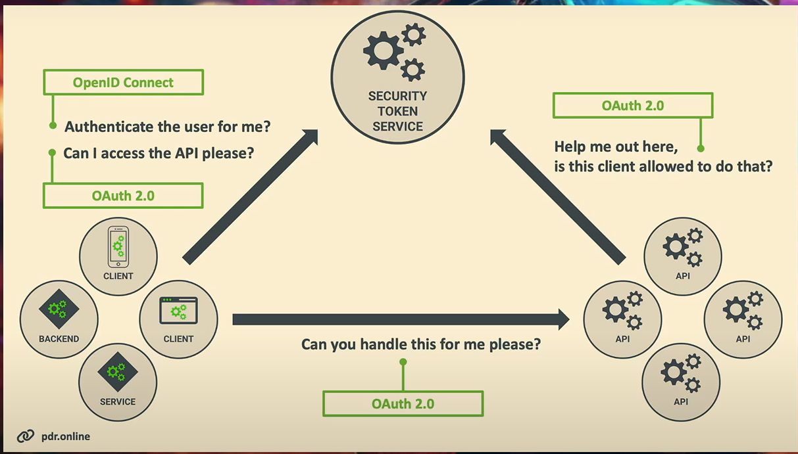

To simplify learning, the speaker introduces consistent terms as follows:

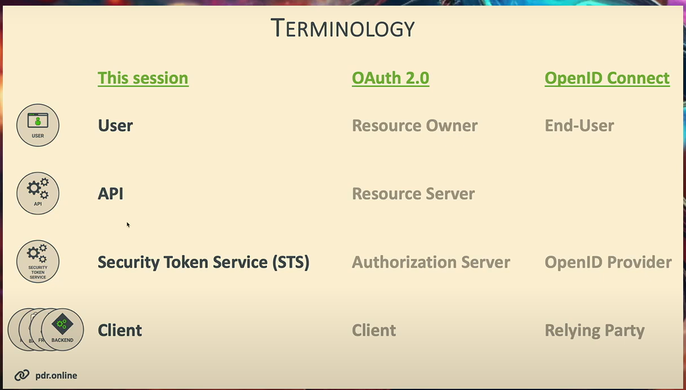

- OAuth and OpenID Connect: Practical Scenarios
    - **Use Case 1: Only OpenID Connect**
        - Applications needing to know “who is the user?” utilize OpenID Connect exclusively for user authentication.
        - The app requests user details and handles sign-in via a central identity provider; developers should avoid building username/password authentication themselves
        - Most modern apps now rely on centralized authentication, delegating security management and account processes to trusted providers e.g., Azure Active Directory
    - **Use Case 2: Only OAuth**
        - When user identity is already established, OAuth enables connecting two systems/
        - The app doesn’t need to know the user’s personal details—only the ability to access resources like APIs by obtaining tokens for authorization
        - **Slack connecting to GitHub repositories:** Slack apps can be granted access to post updates or fetch data from private repositories in GitHub using OAuth tokens, enabling seamless integrations for team collaboration tools

    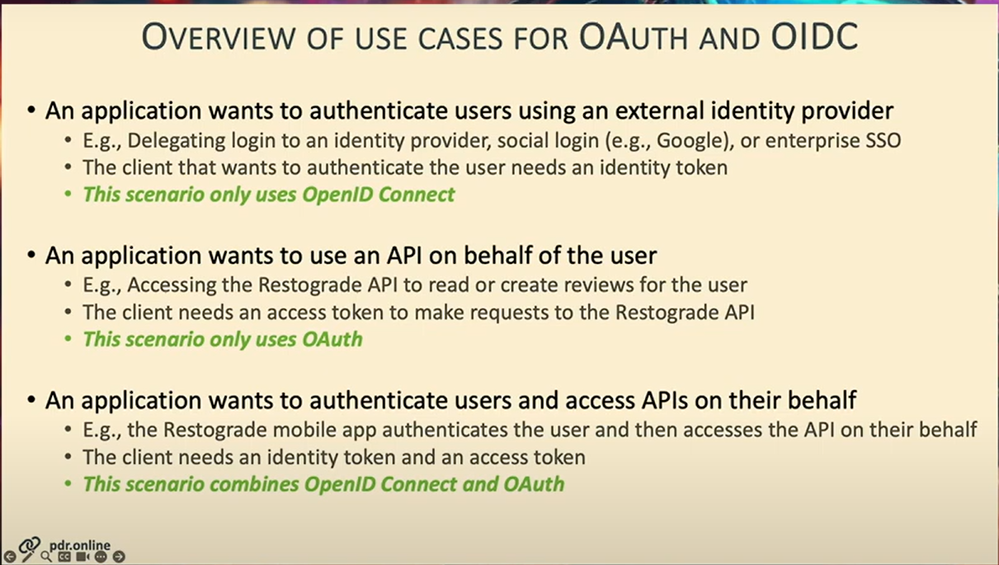

### OAuth and OIDC Flows

OAuth and OpenID Connect (OIDC) flows are protocols that outline how applications securely authenticate users and authorize access to protected resources using tokens

### Authorizaion Code Flow

The Authorization Code Flow is the most commonly used OAuth 2.0 flow and is recommended for web applications that have a backend and can keep a client secret confidential

The process begins --

1. When a user triggers the flow by an action like clicking a login or connect button in an app
2. The backend client app sends an authorization request to the Security Token Service (STS, also called the Authorization Server, for example google), causing the user’s browser to be redirected to the STS.
3. The user is then presented with a login form at the STS where they authenticate themselves by entering credentials.
4. Once authentication succeeds, the STS sends an authorization code back to the client’s backend through a redirect URI encoded in the user's browser.
5. This authorization code is a temporary, one-time-use token that itself has no value to an attacker because it must be exchanged with the STS by the confidential backend client.
6. The backend client then makes a server-to-server POST request to the STS token endpoint, sending the authorization code and authenticating itself by using its client secret.
7. The STS validates the authorization code, client credentials, and other parameters. If valid, it responds with the requested tokens (e.g., access token, and for OpenID Connect, identity token)
8. The backend receives the tokens and can use them to authenticate the user, authorize API calls, or manage session state in the application.

This flow is considered secure because the client secret is never exposed to the browser or user agent, protecting against interception of tokens. The authorization code is one-time use only, so even if intercepted, it cannot be reused by an attacker.

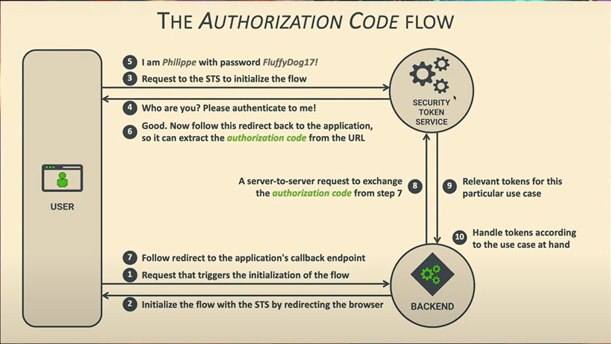

### Authorizaion Code Flow for OIDC

The goal of OIDC with the authorization code flow is to authenticate the user and receive identity information, not just authorize API access. The authorization code flow is the current best practice to implement OIDC.

The process begins --
1. When the user triggers authentication (e.g., clicking “login with Google” or similar), which initiates a redirect to STS.
2. The user authenticates at the STS (Identity Provider), using any method: password, passkey, magic link, or other, as supported by the provider
3. After authentication, the STS redirects the user’s browser back to the application, adding an authorization code to the callback URL.
4. The backend of the application then exchanges the authorization code for tokens by making a POST request to the STS, including its client credentials and the received code
5. If successful, the STS responds with an ID Token (a JWT containing identity claims like "sub"—the unique user identifier, and possibly profile and email information)

The application uses this ID Token to identify and sign in the user, typically mapping the "sub" claim to a user record internally. This process is robust: if the same user signs in again, the same identifier remains, ensuring persistent identity linking

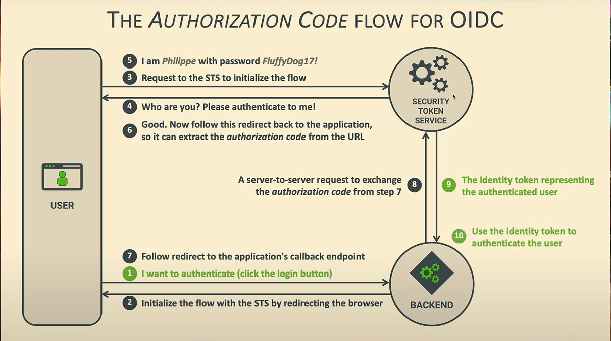
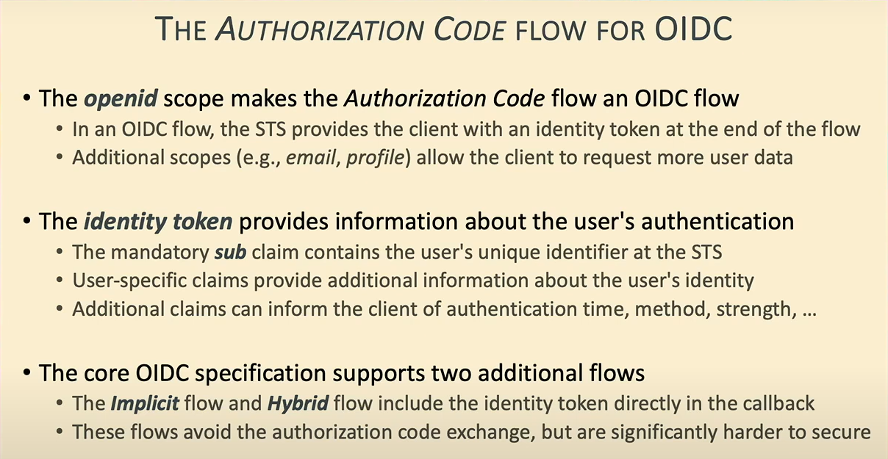

### Authorizaion Code Flow for OAuth

The OAuth authorization code flow manages access to APIs and resources on behalf of the user, focusing on authorization, not authentication

The process starts - 
1. When a user in an application (the client) initiates an action (like “Connect to Restro”) that triggers the flow.
2. The client backend issues an authorization request and redirects the user’s browser to the Authorization Server (security token service)
3. The user logs in (if needed) and consents to sharing data or granting access to the third-party application—this consent screen is a hallmark of OAuth flows.
4. After successful authentication and consent, the Authorization Server sends an authorization code in the browser to the application’s callback endpoint
5. The client backend then exchanges the authorization code for an access token via a back-channel (server-to-server POST) to the Authorization Server, proving its identity with a client ID and secret
6. The backend receives an access token (sometimes a JWT). This token represents the granted permissions and is used by the client to call the target API on behalf of the user.
    - The token typically contains the user identifier (e.g., “sub” claim), which the API uses to associate requests with the correct user, but the client application does not necessarily learn the user’s identity
    - Unlike OIDC, the returned token is solely for resource access, not authentication. (No ID token is given.)
    - The access token expires after a set period (e.g., one hour); optional refresh tokens allow apps to get a new access token without further user involvement

This code flow is secure, scalable, and the de facto standard for web applications needing delegated API access, used in integrations like calendar sync, cloud storage, and more

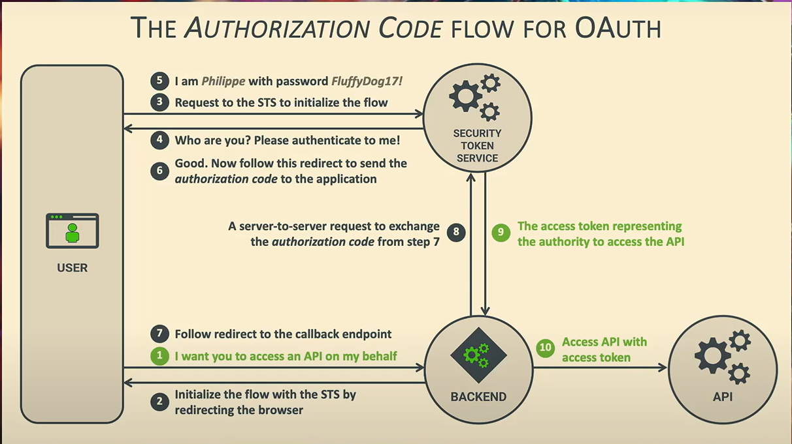

## Authorisation Code Injection Attack

The attacker is able to trick the client application into using an authorization code that was never intended for the current legitimate user session, but rather was generated for the attacker themselves in a separate OAuth flow.

### Step-by-Step Flow of the Attack:

- Step 1: Attacker Gets Their Own Login Code
    - Imagine there’s a “login with Google” button on a website.
    - The attacker uses it to log into the same website, but with their own account.
    - After logging in, the system gives the attacker a special secret “code” (call it "attacker's code"), which normally would let them finish logging in as themselves

- Step 2: Injecting the Code into a Victim’s Login
    - The attacker finds a way (through trickery or a security loophole) to make victims browser send this “attacker’s code” to the website, just as we (the victim) are trying to log in
    - For example, this could happen if there’s a weakness in how the website handles redirects, or if the attacker can somehow control what code our browser sends back during the login process.

- Step 3: The Website Gets Fooled
    - The website receives this “attacker’s code” from our browser.
    - The website mistakenly believes this code came from victims own login attempt, and “redeems” it – meaning it exchanges it for a key that unlocks information or lets us access features.

- Step 4: We’re Signed In…as the Attacker
    - Now, the website links our browsing session to the attacker's account, not ours!
    - What happens next depends on the website: maybe we see the attacker's profile page, maybe we upload our data into the attacker's account, or maybe actions (like posting a status or viewing data) happen under the attacker's identity.

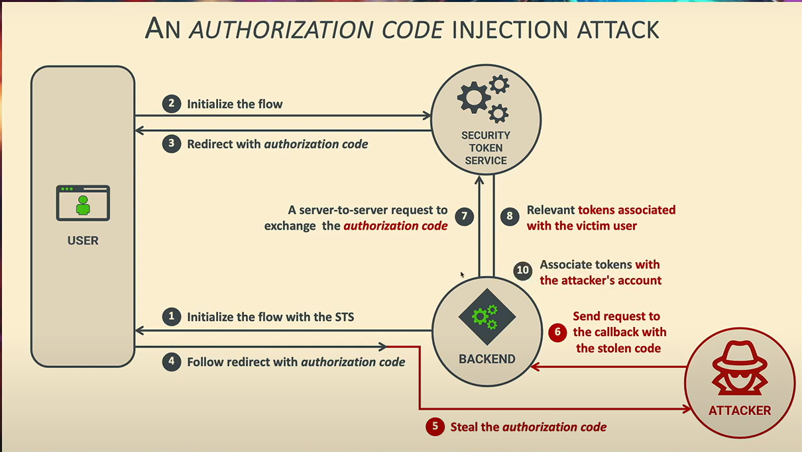

## Securing the flow with PKCE

PKCE (Proof Key for Code Exchange) is used to solve the authorization code injection attack in OAuth 2.0 and OpenID Connect.

### Step-by-Step Explanation of How PKCE Protects

- Step 1: Starting the Login – Generating a Secret
    - When we (the real user) start logging into a website or app, the app creates a secret code just for this login attempt. This secret is called the **code verifier**.
    - The app then creates a scrambled version (or hashed version) of that secret called the code challenge and sends only this scrambled version to the login server (Authorization Server).
    - The server remembers this scrambled secret for this login attempt.

- Step 2: Authorization Server Gives a Temporary Code
    - We go through the normal login steps (entering username/password or using an Identity Provider).
    - After successful login, the Authorization Server sends back a temporary authorization code to the app or our browser

- Step 3: Redeeming the Code Requires the Secret
    - Now, the app itself needs to exchange that authorization code for the real keys (tokens) that show who we are and let us access stuff.
    - But here’s the trick: the app cannot just send that authorization code; it also must send the original secret code verifier it generated at the very start

- Step 4: The Server Cross-Checks the Secret
    - The Authorization Server takes the secret code verifier from the app and scrambles it.
    - It compares this scrambled secret to the original scrambled version (the code challenge) it remembered from the beginning of the login.
    - If the two match, the server knows the app sending the code and secret is the same one that started the login flow and then gives out the tokens.

- Step 5:  Why This Stops the Attacker\
    - The attacker can steal or insert an authorization code, but they do not know the secret code verifier because it was never sent out—it’s only known by the legitimate app during the login flow
    - Without this secret, the attacker cannot successfully turn that stolen code into tokens.
    - So, the attacker’s injected or stolen authorization code is useless without the matching secret.

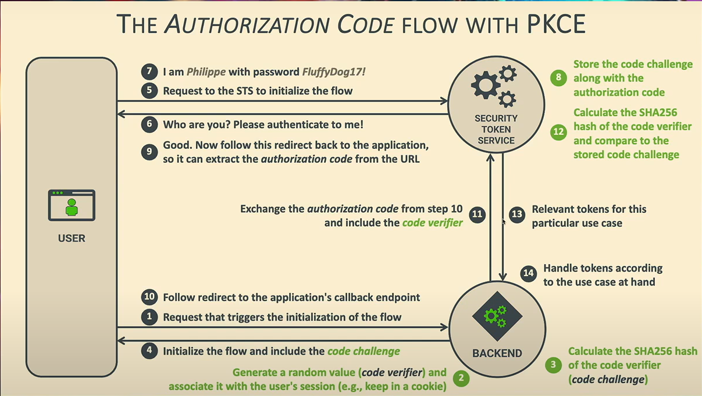
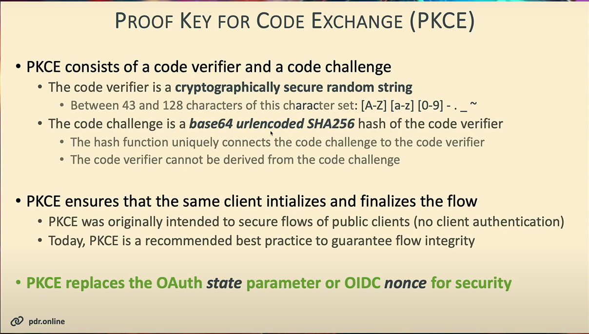

## Refresh Token Flow
- After the initial authorization code flow completes, the client application typically receives an access token and a refresh token from the Authorization Server.
- The access token is a short-lived token that allows the client to access protected resources or APIs on behalf of the user.
- When the access token expires, instead of requiring the user to re-authenticate, the client can use the refresh token to request a new access token from the Authorization Server.
- The client sends a request to the Authorization Server's token endpoint with the refresh token and its own client credentials.
- If the refresh token is valid, the Authorization Server responds with a new access token (and sometimes a new refresh token as well).
- This flow improves user experience by maintaining access without logging in repeatedly and enhances security by limiting the lifetime of access tokens while allowing long-lived sessions through refresh tokens.

    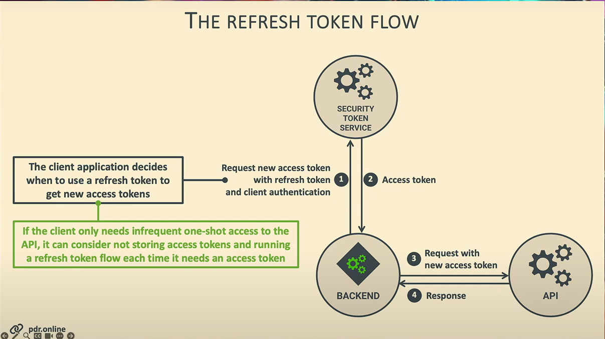

### Handling Refresh Tokens at the Client

- **Store Securely:** Refresh tokens are long-lived and powerful tokens. Store them securely in the client, preferably in environments that attackers cannot easily access (e.g., secure HTTP-only cookies for web apps or secure storage on mobile devices).
- **Use Only for Renewal:** Refresh tokens must only be sent to the Authorization Server to get new access tokens, not used directly for accessing APIs.
- **Rotation Practice:** Implement refresh token rotation where a new refresh token is issued every time the old one is used. This helps detect token theft or reuse attacks and limits damage.
- **Handle Revocation and Errors:** Be prepared to handle refresh token expiration or revocation. Clients should prompt users to re-authenticate if the refresh token is no longer valid.
- **Minimal Exposure:** Avoid exposing refresh tokens to front-end or single-page applications without proper security controls; use PKCE and secure storage when necessary.

### Refresh Token Lifetime
- **Longer Than Access Tokens:** Refresh tokens have a longer lifetime than access tokens (which usually last minutes to hours). Refresh tokens can last days, weeks, or even months, depending on policy.
- **Expiration and Inactivity:** Some systems implement fixed expiry times or expire refresh tokens after prolonged inactivity (e.g., 6 months without use).
- **Revocation Policies:** Refresh tokens can be revoked by the user, server, or automatically due to suspicious activity.
- **Sliding Expiry:** Token lifetimes may be “sliding,” meaning the expiration extends each time the token is used to obtain a new access token.
- **Security Balance:** The lifetime must balance user convenience with security risks—long lifetimes ease user experience but increase risk if compromised.