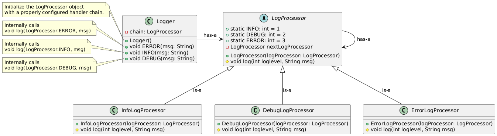

#  Chain of Responsibility Design Pattern

## Overview 

The Chain of Responsibility is a behavioral design pattern that allows a request to be passed along a chain of handlers. Each handler decides either to process the request or to pass it to the next handler in the chain. The sender of the request does not are about which handler handles the request.

It is used to decouple the sender of a request from its receiver by giving multiple objects a chance to handle the request.

## Real-Time Use Cases

| Use Case     | Description        |
| ------------------------------- | --------------------------- |
| **Logging Frameworks**     | Different logging levels (INFO → DEBUG → ERROR). If a handler cannot process a log message, it passes it to the next level. |
| **Event Handling in GUI Toolkits**          | Mouse/keyboard events pass from one component to another until handled.                                                     |
| **Technical Support System**    | A customer request is passed from Level 1 → Level 2 → Level 3 support based on complexity.      |
| **Access Control / Middleware in Web Apps** | Series of middleware functions process HTTP requests (authentication, authorization, validation, etc.)                      |
| **ATM Withdrawal Request**   | Request is passed to different denominations (₹2000 → ₹500 → ₹100) handlers until fulfilled.    |

## Example

lets design a logger system as a example of this. As we know there are multiple logging levels like ERROR, INFO, DEBUG and each will do separete level of logging. 

User can pass any of the log type and the corresponding handler should handle that, no other handle should do the handling.



If the `log(int level, String msg)` method is declared as `public`, it allows the user to pass any integer value as the log level. This leads to a lack of control over valid inputs. For example:

```java
logger.log(LogProcessor.DEBUG, "This is a debug log");
logger.log(LogProcessor.ERROR, "This is an error log");
logger.log(LogProcessor.INFO, "This is an info log");
logger.log(4, "Falls into no category");
```

```bash
DEBUG: This is a debug log  
ERROR: This is an error log  
INFO: This is an info log  
Wrong Log level: Falls into no category
```

In the above scenario, since the value `4` does not correspond to any known log level, it results in undesired behavior. To prevent such misuse, the `log` method should be made `protected`, restricting direct access.

Instead, we should expose dedicated public methods—`info(String msg)`, `debug(String msg)`, and `error(String msg)`using another `loggers` class— which internally invoke the `log` method with the appropriate log level constants.

```bash
Logger logger = new Logger();
logger.ERROR("This is a error log");
logger.INFO("This is a info log");
logger.DEBUG("This is a debug log");
```

## Cloning the Repository
Observer Design pattern is under Design-Patterns repository. You can clone this repository using either SSH or HTTPS.

### SSH
`git clone git@github.com:Sudipta-Sen/Design-Patterns.git`

### HTTP
`git clone https://github.com/Sudipta-Sen/Design-Patterns.git`

## Compile the code

### Navigate to the designpatterns folder
`cd Design-Patterns/src/com/designpatterns`

### Compile the Code
To compile the Behavioral/ObserverPattern package, use the following command

`make behavioral_chain_responsibility`

### Run the Code
Execute the compiled code with:

`java -cp bin com.designpatterns.Behavioral.ChainOfResponsibilityPattern.Main`

### Clean Up: 
To clean up the compiled classes and bin directory, use:

`make clean`