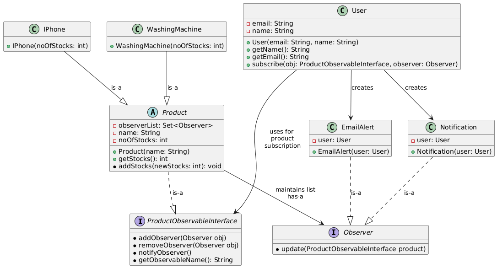

# Observable Pattern

## Overview
The **Observable pattern** is a behavioral design pattern that establishes a one-to-many relationship between objects, allowing an object (known as the **Observable**) to notify multiple **Observers** of any changes in its state. This pattern is particularly useful when a change in one object requires changes in other objects, but the exact nature of those changes isn't known until runtime.

## Real-Life Example: Amazon "Notify Me" Feature

In Amazon, when a product is out of stock, users have the option to click the "Notify Me" button. Once clicked, the user subscribes to notifications for when the product becomes available again. When the product is back in stock, all subscribed users (Observers) are notified either via email, SMS, or app notifications.

### Key Components

In our example

**1. Observable:** Amazon product. 
**2. Observer:** Users who has subscribed to notifications.

### Pattern Explanation

#### Observable (Product):
1. There can be many Observers for a single Observable object.
2. Whenever the state of the Observable object changes (e.g., the product comes back in stock), it notifies all its Observers.

#### Observer (User):
1. Observers are interested in the state change of the Observable object.
2. When notified, each Observer can take the necessary action (e.g., receive an email, SMS, or app notification)
Real life example of observable pattern -- 

In amazon when there is a product which is out of stock and many people wants that as soon as it becomes in stock then they click 'Notify Me' button.
Then when the product becomes availble all the people that subscribe get notified either by email or by sms or by app notification. This 'Notify Me'
is implemented via observable pattern.

### Implementation Details

1. **Subject (Observable) —** `ProductObservableInterface`
    - Declares methods to add, remove, and notify observers.
    - All products that want to be observed (like `IPhone`, `WashingMachine`) will implement this interface via the `Product` abstract class.

2. **Abstract Subject —** `Product`
    - Implements the `ProductObservableInterface`.
    - Maintains a list of observers (`observerList`) and a `name` for the product.
    - Provides methods to manage stock. When stock is added and it was previously 0, it notifies all observers.

3. **Concrete Products —** `IPhone`, `WashingMachine`
    - Extend the `Product` abstract class.
    - They implement product-specific stock management logic by calling `addStocks()`.

4. **Observer Interface —** `Observer`
    - Declares the `update(ProductObservableInterface product)` method that all observers must implement.

5. **Concrete Observers —** `EmailAlert`, `Notification`
    - Implement the `Observer` interface.
    - Have access to the `User` that wants to be alerted.
    - They react when the product becomes available by executing their `update()` method.
    - Each concrete observer will implement their own `update()` method which will be called by the Observable's **notifyObserver()** method.

6. **User**
    - Represents a user with `name` and `email`.
    - Provides a `subscribe()` method to attach an observer (like `EmailAlert` or `Notification`) to a product.

### Relationship Between Observable and Observer
1) The relationship between Observable and Observer is a "has-a" relationship.
2) Multiple Observers can be associated with a single Observable.

## Cloning the Repository
Observer Design pattern is under Design-Patterns repository. You can clone this repository using either SSH or HTTPS.

### SSH
`git clone git@github.com:Sudipta-Sen/Design-Patterns.git`

### HTTP
`git clone https://github.com/Sudipta-Sen/Design-Patterns.git`

## Compile the code

### Navigate to the designpatterns folder
`cd Design-Patterns/src/com/designpatterns`

### Compile the Code
To compile the Behavioral/ObserverPattern package, use the following command

`make behavioral_observer`

### Run the Code
Execute the compiled code with:

`java -cp bin com.designpatterns.Behavioral.ObserverPattern.main`

### Clean Up: 
To clean up the compiled classes and bin directory, use:

`make clean`