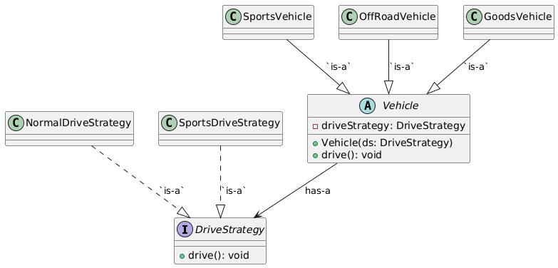

# Strategy Design Patterns

## Overview
This repository contains Java implementations of various design patterns. The primary focus is on demonstrating the Strategy Pattern, which is used to separate the dependency of the drive mechanism from the main class. This approach adheres to 
- The Open-Closed Principle  (new strategies can be added without modifying existing code)
- Allowing for dynamic injection of drive strategies based on client requirements.

## Strategy Pattern

In the Strategy Pattern example:

1. **Strategy Interface:**
    - This defines a family of strategies (driving behavior, `DriveStrategy`).
2. **Concrete Strategies:**
    - `NormalDriveStrategy`, `SportsDriveStrategy`
    - These are interchangeable strategies that can be used by any `Vehicle`.
    - We can introduce new driving behaviors by simply creating a new class that implements the `DriveStrategy` interface and defines the `drive()` method. This allows us to extend functionality without modifying any existing code, adhering to the Open/Closed Principle.
3. **Abstract Vehicle Class:**
    - This class uses **composition** to hold a reference to `DriveStrategy`.
    - Behavior can be changed dynamically by injecting a different strategy. (contructor injection)
4. **Concrete Vehicles:**
    - `GoodsVehicle`, `OffRoadVehicle`, `SportsVehicle`
    - Each concrete vehicle **decides its driving strategy at instantiation time**.
    - We can create new types of vehicles by extending the abstract `Vehicle` class and assigning any existing or newly implemented `DriveStrategy`, enabling flexible and scalable vehicle behavior.

## Cloning the Repository
Strategy Design pattern is under Design-Patterns repository. You can clone this repository using either SSH or HTTPS.

### SSH
`git clone git@github.com:Sudipta-Sen/Design-Patterns.git`

### HTTP
`git clone https://github.com/Sudipta-Sen/Design-Patterns.git`

## Compile the code

### Navigate to the designpatterns folder
`cd Design-Patterns/src/com/designpatterns`

### Compile the Code
To compile the Behavioral/strategy package, use the following command

`make behavioral_strategy`

### Run the Code
Execute the compiled code with:

`java -cp bin com.designpatterns.Behavioral.strategy.main`

### Clean Up: 
To clean up the compiled classes and bin directory, use:

`make clean`